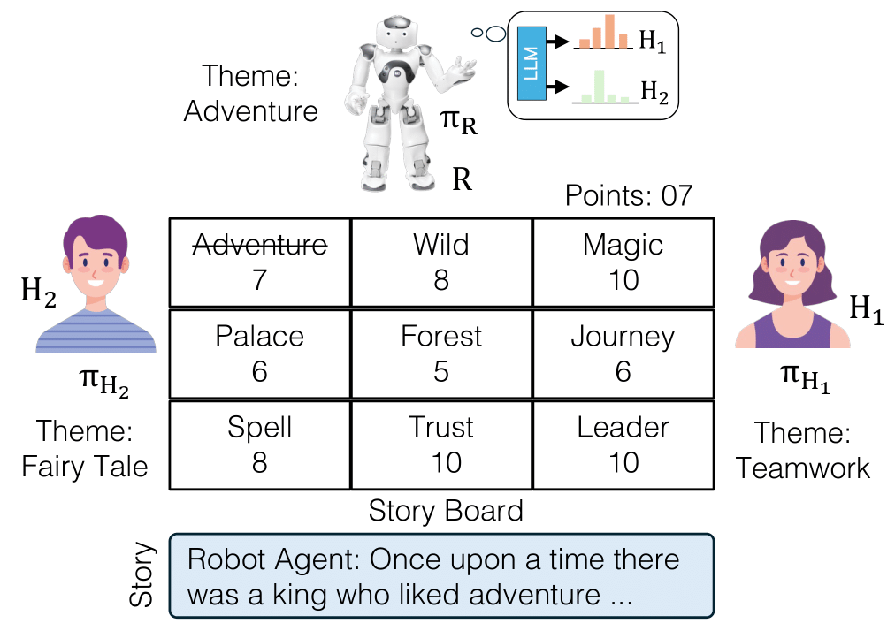
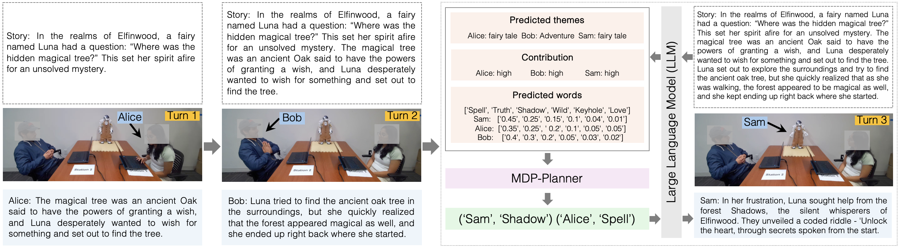

[**Website**](https://github.com/aaai2026-review/preference-aware/)
| [**Code**](https://github.com/aaai2026-review/preference-aware/tree/main/Code/)
| [**Story Dataset**](https://github.com/aaai2026-review/preference-aware/tree/main/story_dataset/)


## Leveraging Preferences for Adaptive Decision-Making in Human-Agent Interaction

<p align="center">
  
</p>


Humans excel at rapidly modeling team members' latent factors, such as preferences, even with limited interaction data. However, replicating this capability in human-agent teams is challenging because existing approaches often require either complex computational models of human behavior or large amounts of interaction data, which are often infeasible for real-time deployments. To overcome these limitations, we propose a novel preference-aware decision-making framework that bridges the gap between model-driven and data-driven methods to enable real-time human-agent interaction. In particular, our approach formulates the agent’s decision-making process as a Markov Decision Process (MDP), where the framework estimates human preference distribution by leveraging a Large Language Model (LLM) and incorporates that to solve the MDP, enabling the agent to make adaptive decisions that optimize long-term collaborative outcomes. We evaluate the framework in a large-scale human-agent interaction study (n = 40) using a collaborative storytelling task to assess its impact on task performance and participants' perceptions of collaboration. Our findings indicate that the proposed framework significantly improved task performance, story quality, and robot contribution while enhancing perceived collaboration fluency, agent competency, and interactivity compared to a myopic baseline. Moreover, external evaluators also found the preference-aware strategy to yield more fluent collaboration and higher-quality stories than the baseline. These findings will enable the development of more collaborative and effective agents to improve task performance and user experience across various environments.

### Preference-aware Decision-Making Framework Overview

<figure>

</figure>


#### Dataset Structure:
The collaborative story dataset is available on [Story Dataset](https://github.com/aaai2026-review/preference-aware/tree/main/story_dataset/)

```
raw_data
    |- baseline_sessions
        |-session_1.json
        |-session_2.json
         ...
    |- proposed_sessions
        |-session_1.json
        |-session_2.json
         ...

session_wise_processed_stories
    |- session_1
        |-baseline_method.txt
        |-preference_aware_method.txt

    |- session_2
        |-baseline_method.txt
        |-preference_aware_method.txt
    ...
         
```

### Experiments

We conducted a human-robot study to evaluate whether our preference-aware decision-making framework leads to better task performance and story quality than a myopic baseline that ignores human preferences. 

**1. The preference-aware framework:** infers user preferences via an LLM, solves an MDP to optimize long-term team rewards, and selects narrative words accordingly.

**2. Myopic baseline:** selects words based solely on immediate reward, using word weight, theme relevance, and story coherence without modeling preferences. 

Both approaches use the same LLM for generation to ensure fair comparison.


